# Align a Small LLM with GRPO for Strict JSON Generation
- **Group ID**: G23
- **Project ID**: 23

---

## 1. Introduction and Objective

Large Language Models can produce fluent natural language but frequently struggle with **structured output** — syntactically valid, schema-conformant JSON is critical for tool-use, API integrations, and agent pipelines, yet even instruction-tuned models inject conversational filler, omit closing brackets, or violate type constraints.

This project investigates whether **Group Relative Policy Optimization (GRPO)** [6], a reinforcement learning technique that forgoes a neural reward model in favour of group-level advantage normalisation, can reliably teach small LLMs (135 M – 2 B parameters) to produce strict JSON output.

Recent work has shown that rule-based rewards can effectively guide LLMs toward strict schema adherence [1] and that lightweight RL frameworks can enforce structured output without large-scale RLHF infrastructure [2]. Reward-driven RL has also proved effective for tool-use tasks [4], while curriculum-style GRPO training has been applied to code generation [3]. Building on these insights, our main hypothesis is that a combination of (i) five rule-based reward components providing dense, interpretable signal, (ii) a 3-stage curriculum that gradually increases task difficulty, and (iii) parameter-efficient 4-bit LoRA fine-tuning is sufficient to bring sub-2 B models from near-zero JSON compliance to high pass rates — closing the gap to much larger proprietary models for this narrow but practically important task.

## 2. Contribution and Added Value

We built a **multi-model GRPO fine-tuning pipeline for strict JSON generation** that goes beyond simply running the TRL `GRPOTrainer`:

1. **Five rule-based reward components** (format, validity, schema, truncation, reasoning) with additive composition and graduated partial credit — inspired by the reward architectures of [1] and [2], and designed to avoid the GRPO "zero-advantage collapse" that occurs when all completions in a group receive the same score.

2. **3-stage curriculum learning** that shifts the difficulty distribution across 2 500 training steps, enabling models to first master the code-fence format before tackling complex nested schemas — extending the curriculum ideas explored in [3] to structured-output tasks.

3. **Systematic comparison across five model families** (SmolLM2 135 M/360 M, Qwen 2.5-0.5 B, TinyLlama 1.1 B, Gemma-2 2 B), all under identical quantisation, LoRA, and curriculum settings — isolating the effect of model capacity.

4. **End-to-end reproducible infrastructure**: per-model configs, automated SLURM chain pipeline with live monitoring, stratified evaluation with difficulty breakdown, and a parametric synthetic dataset generator producing unlimited training samples.

## 3. Data Used

### Source

The dataset is **fully synthetic**, generated programmatically by `src/datasets/synthetic_dataset.py` using a library of 24 parameterised prompt templates (8 per difficulty tier, defined in `src/datasets/templates.py`). No external data is downloaded or scraped.

### Statistics

| Split | Samples | Purpose |
|---|---|---|
| Train | 1 500 per curriculum stage × 3 stages | GRPO policy gradient updates |
| Eval | 999 (334 simple / 333 medium / 333 hard) | Balanced assessment |
| Baseline test | 999 (same balanced set) | Pre-training comparison |

Each sample consists of a **system prompt**, a **user instruction**, and a **difficulty label** (simple · medium · hard). No ground-truth JSON is provided — the reward functions evaluate completions directly.

### Template taxonomy

| Difficulty | Templates | Typical task |
|---|---|---|
| **Simple** (8) | Flat key-value objects, typed arrays, entity cards, key-value mappings | "Generate a JSON object with 3 keys: name (string), age (integer), active (boolean)" |
| **Medium** (8) | Nested objects, config files, form schemas, multi-section documents | "Generate a user profile with 6 fields including a nested address and a tags array" |
| **Hard** (8) | JSON Schema draft-07, paginated API responses, deeply nested hierarchies, OpenAPI specs, workflow definitions | "Generate a JSON Schema for a REST API error with required fields, type constraints, and array validation" |

### Preprocessing

Each template's `params()` method draws random parameters (key names, counts $N \in [2, 7]$, entity types) from curated domain lists, ensuring high diversity. The difficulty distribution varies per curriculum stage (see §4.3). The random seed (42) and per-stage metadata are cached to guarantee reproducibility.

## 4. Methodology and Architecture

### 4.1 Overview

**Base architecture.** All five models are decoder-only transformer LLMs loaded from HuggingFace Hub, quantised to **4-bit NF4** with `bfloat16` compute dtype using `BitsAndBytesConfig`. A **LoRA** adapter ($r{=}16$, $\alpha{=}32$, dropout $= 0$) is attached to the seven linear projections (`q_proj`, `k_proj`, `v_proj`, `o_proj`, `gate_proj`, `up_proj`, `down_proj`), keeping the base weights frozen and training only ~0.5–2% of total parameters.

**Training algorithm.** We use the TRL `GRPOTrainer`, which implements GRPO as follows: for each prompt $x$, the current policy $\pi_\theta$ generates $G{=}8$ completions $\{y_1, \ldots, y_G\}$; each completion is scored by the rule-based reward (§4.2); rewards are normalised within the group to obtain advantages $\hat{A}_i = (r_i - \mu_G) / \sigma_G$; the policy is updated to increase the probability of above-average completions while penalising below-average ones, regularised by a KL divergence term ($\beta{=}0.04$) against the reference policy.

**Training hyperparameters** (shared across all models):

| Parameter | Value |
|---|---|
| Effective batch size | $1 \times 8$ (per-device × gradient accumulation) |
| Learning rate | $5 \times 10^{-6}$ (cosine schedule, 10% warmup) |
| Optimizer | Paged AdamW 8-bit |
| Weight decay | 0.1 |
| Max grad norm | 0.1 |
| Max prompt length | 512 tokens |
| Max completion length | 1 024 tokens |
| Max sequence length | 2 048 tokens |
| Generations per prompt ($G$) | 8 |
| KL penalty ($\beta$) | 0.04 |
| Checkpoint save interval | Every 60 steps (keep 3) |

**Hardware.** All training runs on a single NVIDIA L40S GPU (48 GB, 22 528 MB SLURM shard) via the DMI UniCT cluster, managed by Apptainer containers and SLURM.

### 4.2 Reward Functions

GRPO replaces the traditional reward model with rule-based reward functions that provide a dense, interpretable signal [1, 2, 4]. Each completion is scored independently by five components; GRPOTrainer computes the weighted sum $r = \sum_{i} w_i \cdot r_i$ and normalises across the generation group to obtain per-sample advantages.

#### Component summary

| Component | Range | Weight | Purpose |
|:---|:---:|:---:|:---|
| `format_reward` | $[0, 1]$ | 0.25 | Checks for a proper ` ```json ... ``` ` code fence (1.0), a generic ` ``` ... ``` ` fence (0.5), or no fence (0.0). |
| `validity_reward` | $[0, 1]$ | 0.30 | Graduated score based on JSON parseability. Valid JSON → 1.0; for invalid JSON the score is proportional to how far into the string the first parse error occurs (0.70 if error in the last 15%, down to 0.20 if in the first 40%). |
| `schema_reward` | $[0, 1]$ | 0.30 | Average of constraint checks extracted from the instruction: exact/minimum array count, required key presence, nesting depth, top-level type (array vs object). Returns 1.0 if JSON is valid but no constraints are extractable. |
| `truncation_reward` | $[-1, +1]$ | 0.15 | Detects completions truncated mid-generation (hitting `max_completion_length`). Returns 1.0 for structurally complete output, 0.0 if no JSON is detected (neutral), and **−1.0** for bare JSON with unclosed braces/brackets, trailing commas, or unterminated strings. |
| `reasoning_reward` | $[0, 1]$ | 0.0 | Bonus for `<think>…</think>` reasoning blocks (≥ 20 chars). Disabled (`weight = 0`) in the current configuration (`thinking: false`). |

#### Design rationale

- **Additive, not gating.** Each component contributes independently to the total reward. This avoids the "zero advantage" problem: if all completions in a GRPO group scored exactly 0 (e.g., because of a hard gate on format), the advantage standard deviation would be 0 and the policy gradient would vanish — the model would never learn to produce code blocks.

- **No length bias on correct output.** Both `validity_reward` and `schema_reward` return 1.0 for any valid, constraint-satisfying JSON regardless of length. The graduated scores in `validity_reward` (0.20–0.70) apply only to *invalid* JSON and reflect how much of the string was correct before the error — this is intentional partial credit to provide gradient signal during early training. `schema_reward` checks structural properties (count, keys, depth, type), not string length.

- **Truncation as negative reward.** The `truncation_reward` is the only component that returns negative values. Its effective influence is $0.15 \times 2.0 = 0.30$ (weight × range amplitude), matching the influence of `validity_reward` and `schema_reward` ($0.30 \times 1.0 = 0.30$ each). This ensures truncated completions receive a strong penalty without dominating the overall signal.

- **Weight redistribution.** When `thinking: false`, the `reasoning_reward` weight is redistributed proportionally across all remaining active components, preserving their relative ratios (e.g., format 0.25 : validity 0.30 : schema 0.30 : truncation 0.15 stays in the same ratio).

### 4.3 Curriculum Learning

Training is divided into three progressive stages totalling 2 500 optimisation steps. Each stage draws fresh training samples (1 500 per stage) from the same template library but with different difficulty distributions and generation temperatures.

| Stage | Name | Steps | Simple | Medium | Hard | Temperature |
|---|---|---|---|---|---|---|
| 1 | `format_basics` | 800 | 35% | 55% | 10% | 0.8 |
| 2 | `progressive` | 800 | 15% | 35% | 50% | 0.7 |
| 3 | `full_difficulty` | 900 | 10% | 25% | 65% | 0.6 |

**Stage 1 — Format basics.** The model sees mostly simple and medium prompts with high temperature, learning to reliably wrap output in ` ```json ``` ` fences and produce parseable JSON. The high simple-prompt ratio reduces frustration early on.

**Stage 2 — Progressive.** Hard prompts become the majority. The model has learned the output format and now focuses on structural correctness (nested objects, arrays, required keys).

**Stage 3 — Full difficulty.** Two-thirds of prompts are hard (JSON Schema, OpenAPI, workflows). Temperature is lowered to 0.6, tightening the generation distribution and improving consistency on complex structures.

**Implementation details.** The same model object is reused across stages (weights updated in-place), but a fresh optimizer and LR schedule are created for each stage. All stages log to a single Weights & Biases run. Per-stage datasets are cached to disk with metadata and regenerated only if the configuration changes.

## 5. Results and Discussion

### Baseline (pre-training)

**Table 1**: Baseline Pass@1 — off-the-shelf models on the balanced evaluation set (300 samples: 100 simple / 100 medium / 100 hard).

| Model | Overall | Simple | Medium | Hard |
|:---|:---:|:---:|:---:|:---:|
| SmolLM2-135M-Instruct | 0.3867 | 0.6000 | 0.3600 | 0.2000 |
| SmolLM2-360M-Instruct | 0.7733 | 0.8600 | 0.8800 | 0.5800 |
| Qwen2.5-0.5B-Instruct | 0.9300 | 0.9900 | 0.9200 | 0.8800 |
| TinyLlama-1.1B-Chat-v1.0 | 0.7300 | 0.9000 | 0.7400 | 0.5500 |
| Gemma-2-2B-it | 0.9600 | 1.0000 | 0.9700 | 0.9100 |

The baseline reveals a clear capacity hierarchy: Gemma-2-2B (96.00%) and Qwen2.5-0.5B (93.00%) already produce valid JSON in the vast majority of cases, while SmolLM2-135M struggles at 38.67% — barely above random compliance. Across all models, the hard difficulty tier consistently shows the lowest pass rates, confirming that nested schemas, JSON Schema draft-07, and OpenAPI-style outputs are the main failure point for small instruction-tuned models.

### Post-GRPO (after curriculum)

**Table 2**: Post-training Pass@1 — after 2 500 GRPO steps with 3-stage curriculum.

| Model | Overall | Simple | Medium | Hard | Δ Overall |
|:---|:---:|:---:|:---:|:---:|:---:|
| SmolLM2-135M-Instruct | 0.8600 | 0.9400 | 0.8200 | 0.8200 | **+0.4733** |
| SmolLM2-360M-Instruct | 0.9467 | 0.9200 | 0.9700 | 0.9500 | **+0.1733** |
| Qwen2.5-0.5B-Instruct | 0.9633 | 0.9900 | 0.9400 | 0.9600 | **+0.0333** |
| TinyLlama-1.1B-Chat-v1.0 | 0.9633 | 1.0000 | 0.9300 | 0.9600 | **+0.2333** |
| Gemma-2-2B-it | 0.9733 | 1.0000 | 0.9700 | 0.9500 | **+0.0133** |

After the full curriculum, all five models converge to the 86–97% range. The most dramatic improvement is SmolLM2-135M, which jumps from 38.67% to 86.00% (+47.33 pp) — demonstrating that even very small models can learn strict JSON formatting through GRPO. TinyLlama-1.1B also shows a substantial gain (+23.33 pp), closing the gap to Gemma-2-2B despite having roughly half the parameters. Models that were already strong (Qwen2.5-0.5B, Gemma-2-2B) see modest but consistent improvements, mainly on hard prompts.

### Curriculum stage progression

**Table 3**: Pass@1 at the end of each curriculum stage (evaluated on the balanced 300-sample set).

| Model | Baseline | Stage 1 | Stage 2 | Stage 3 |
|:---|:---:|:---:|:---:|:---:|
| SmolLM2-135M-Instruct | 0.3867 | 0.5900 | 0.7700 | 0.8600 |
| SmolLM2-360M-Instruct | 0.7733 | 0.8533 | 0.8800 | 0.9467 |
| Qwen2.5-0.5B-Instruct | 0.9300 | 0.9367 | 0.9667 | 0.9633 |
| TinyLlama-1.1B-Chat-v1.0 | 0.7300 | 0.9000 | 0.9333 | 0.9633 |
| Gemma-2-2B-it | 0.9600 | 0.9733 | 0.9633 | 0.9733 |

The curriculum produces monotonically increasing performance for all models except Gemma-2-2B, where the near-ceiling baseline leaves little room for improvement. Stage 1 (format basics) accounts for the largest single-stage gain in all models, confirming that learning the ` ```json ``` ` code-fence pattern is the critical first step. Stages 2 and 3 yield progressively smaller increments but are essential for hard prompts — SmolLM2-135M's hard-prompt pass rate grows from 20% (baseline) → 37% (S1) → 64% (S2) → 82% (S3).

### Per-model analysis

Results are organised by model, from smallest to largest. Each model's evaluation artifacts — JSON metrics, completions, and all figures — are stored in the corresponding subdirectory under `experiments/logs/grpo/`.

---

#### SmolLM2-135M-Instruct

> **Eval directory**: [`experiments/logs/grpo/smollm2-135m/eval_20260403_213246/`](../experiments/logs/grpo/smollm2-135m/eval_20260403_213246/)

SmolLM2-135M is the smallest model in the study and starts with the weakest baseline (38.67%). The GRPO curriculum produces the **largest absolute improvement of any model** (+47.33 pp), taking it from unreliable to usable. The hard-prompt pass rate quadruples from 20% to 82%, while simple prompts reach 94%.

**Curriculum progression** — The grouped bar chart shows steady improvement across all difficulty tiers, with the gap between simple and hard narrowing significantly by Stage 3:

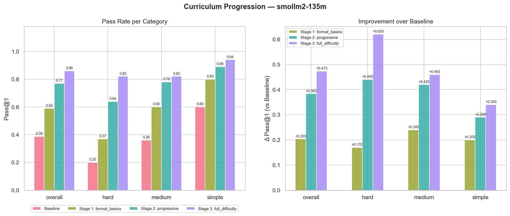

**Stage × Difficulty heatmap** — The heatmap highlights the transformation: hard prompts go from deep red (0.20) to solid green (0.82):

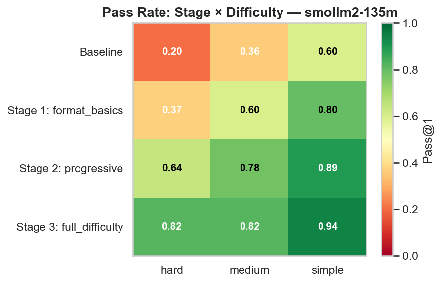

**Error evolution** — The dominant error type shifts from `no_code_block` in the baseline to increasingly valid output, with `json_error` becoming the remaining failure mode:

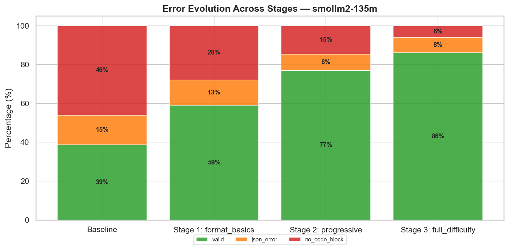

**Rescued vs Regressed** — The vast majority of prompt-level changes are rescues (baseline fail → GRPO pass), with very few regressions:

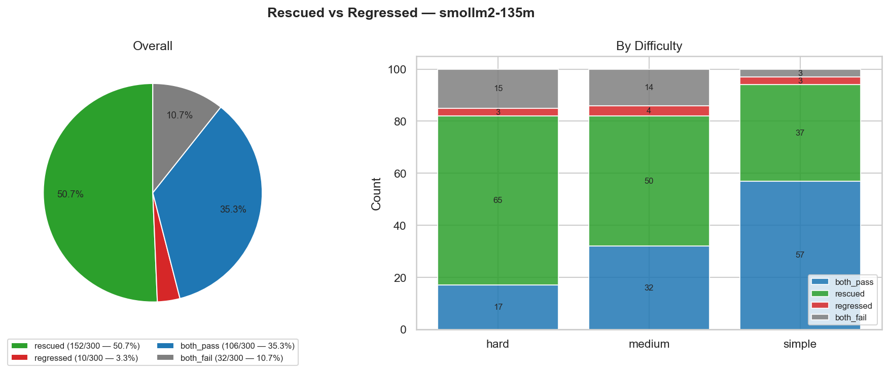

---

#### SmolLM2-360M-Instruct

> **Eval directory**: [`experiments/logs/grpo/smollm2-360m/eval_20260404_014114/`](../experiments/logs/grpo/smollm2-360m/eval_20260404_014114/)

With 2.7× more parameters, SmolLM2-360M starts at a much higher baseline (77.33%) and reaches 94.67% after training (+17.33 pp). The improvement concentrates on hard prompts (58% → 95%), while simple and medium prompts were already largely solved.

**Curriculum progression**:

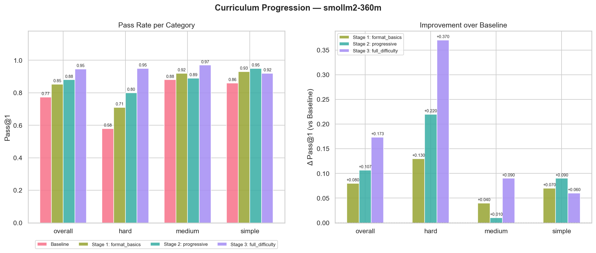

**Stage × Difficulty heatmap**:

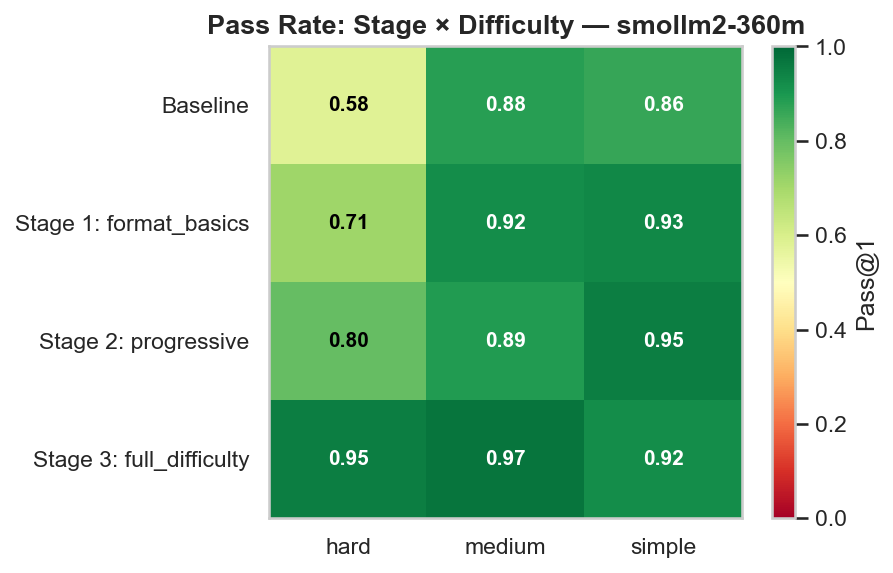

**Error evolution**:

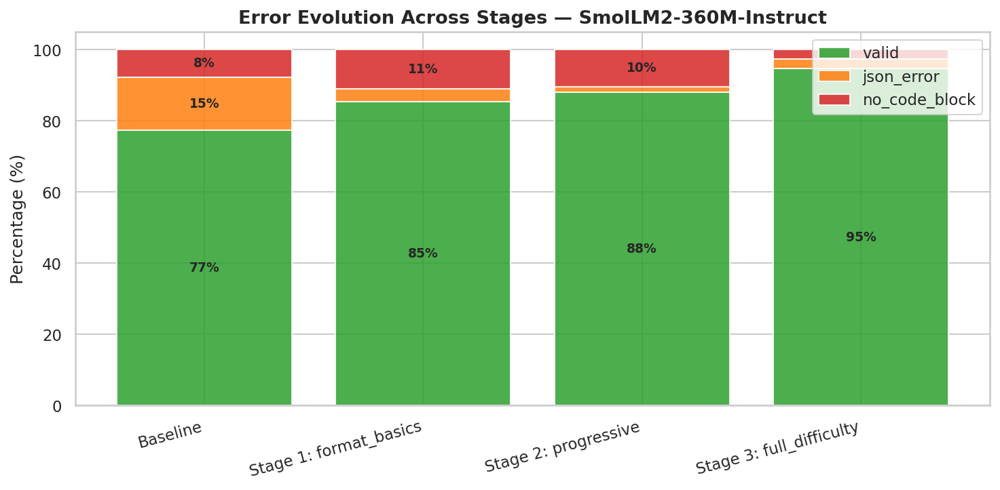

**Rescued vs Regressed**:

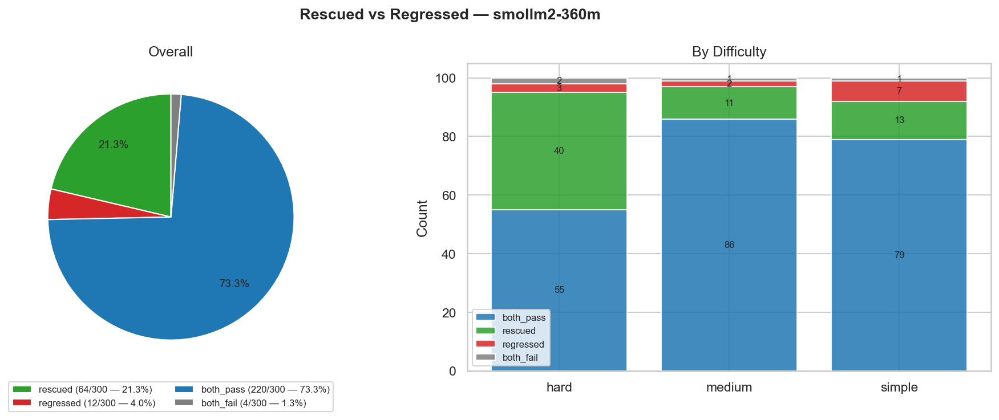

---

#### Qwen2.5-0.5B-Instruct

> **Eval directory**: [`experiments/logs/grpo/qwen25-05b/eval_20260404_045440/`](../experiments/logs/grpo/qwen25-05b/eval_20260404_045440/)

Qwen2.5-0.5B is the most capable model per parameter in the baseline: at 0.5 B parameters it already achieves 93.00%, outperforming TinyLlama-1.1B (73.00%) which is 2× larger. Post-GRPO improvement is modest (+3.33 pp) but focuses exactly where needed — hard prompts improve from 88% to 96%. The slight dip in Stage 1 hard-prompt performance (88% → 84%) suggests that the easy-heavy Stage 1 distribution temporarily shifts the model's attention away from complex schemas, but Stages 2–3 recover and surpass the baseline.

**Curriculum progression**:

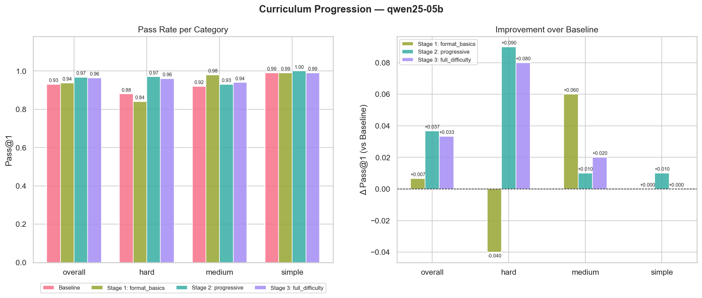

**Stage × Difficulty heatmap**:

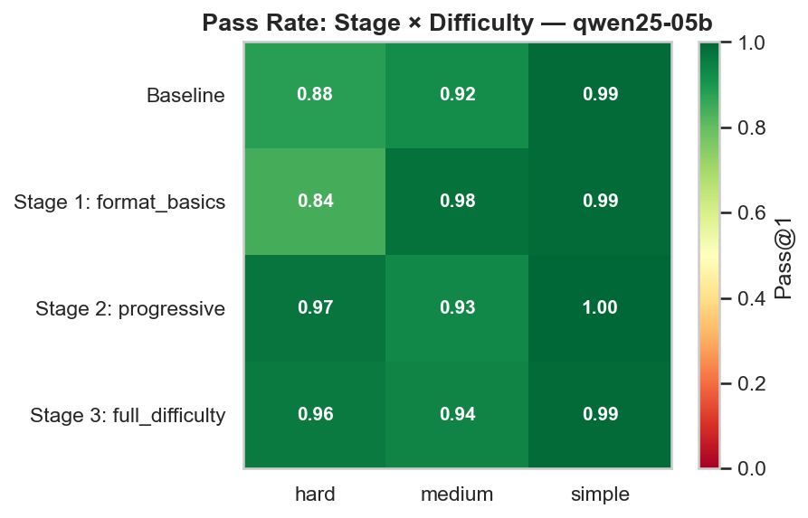

**Error evolution**:

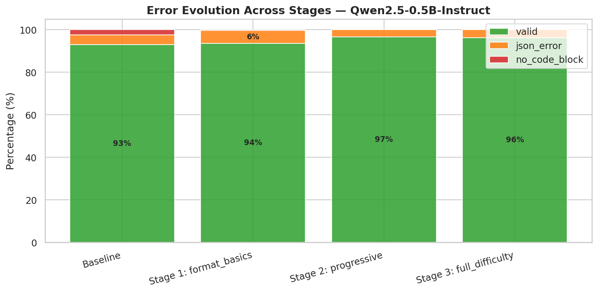

**Rescued vs Regressed**:

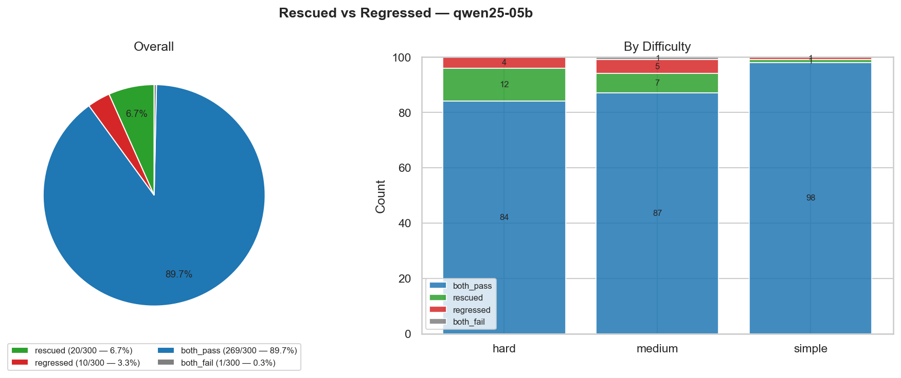

---

#### TinyLlama-1.1B-Chat-v1.0

> **Eval directory**: [`experiments/logs/grpo/tinyllama-11b/eval_20260404_081506/`](../experiments/logs/grpo/tinyllama-11b/eval_20260404_081506/)

TinyLlama-1.1B has the second-largest absolute improvement (+23.33 pp), rising from 73.00% to 96.33%. It achieves **100% on simple prompts** after Stage 1 and maintains that ceiling throughout. Hard prompts show the steepest climb (55% → 96%), nearly matching the 2 B Gemma-2. The strong responsiveness to GRPO suggests that TinyLlama's base model already has the capacity for structured output but needs the RL signal to activate it.

**Curriculum progression**:

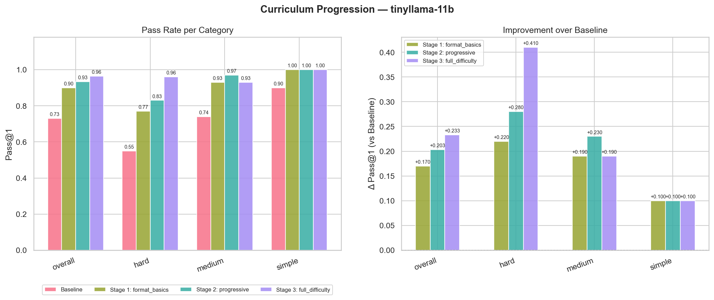

**Stage × Difficulty heatmap**:

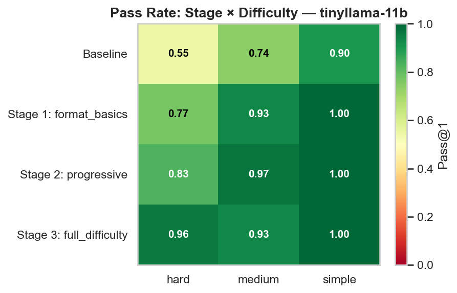

**Error evolution**:

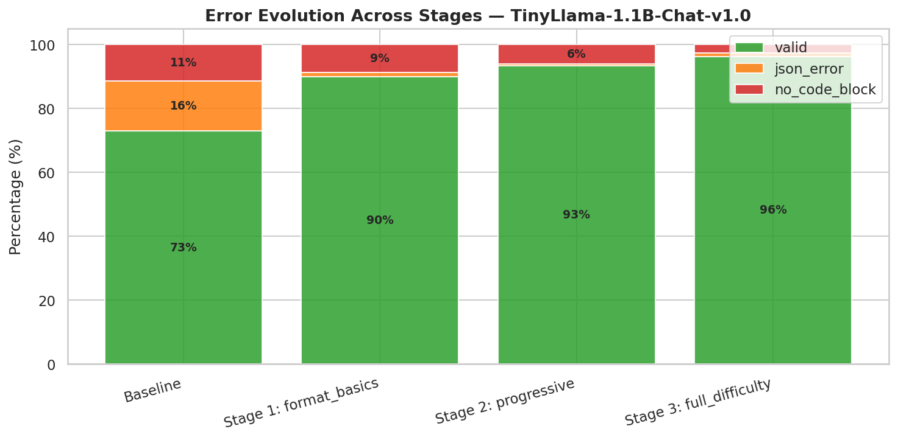

**Rescued vs Regressed**:

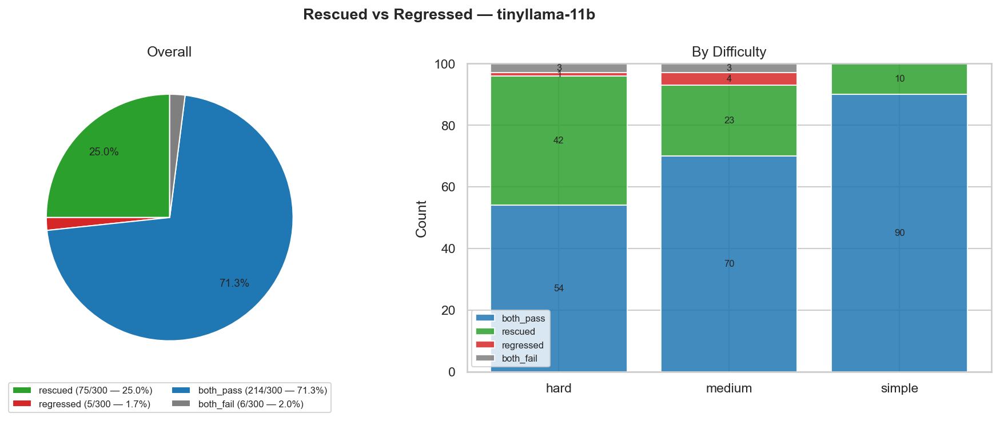

---

#### Gemma-2-2B-it

> **Eval directory**: [`experiments/logs/grpo/gemma2-2b/eval_20260404_195549/`](../experiments/logs/grpo/gemma2-2b/eval_20260404_195549/)

Gemma-2-2B is the largest model and starts with the highest baseline (96.00%). Post-GRPO improvement is minimal (+1.33 pp), reaching 97.33%. Hard prompts improve from 91% to 95%, but medium prompts remain at 97% — there is essentially no room left for improvement on simple prompts (100% throughout). The Stage 2 overall dip (97.33% → 96.33%) is due to a temporary regression on hard prompts (93% → 89%), which recovers in Stage 3 to 95%.

**Curriculum progression**:

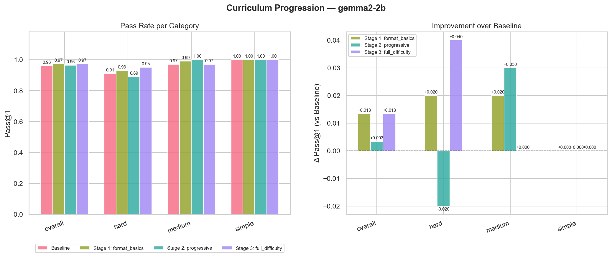

**Stage × Difficulty heatmap**:

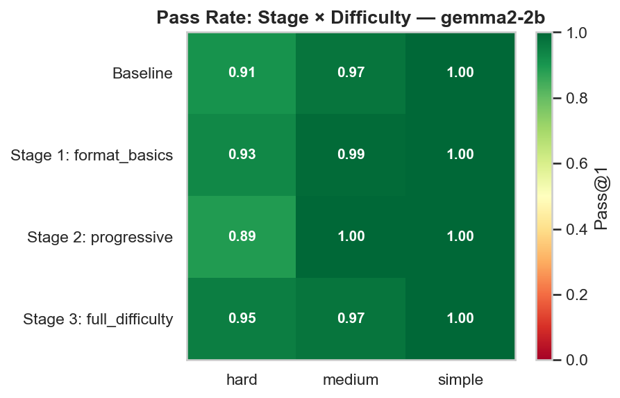

**Error evolution**:

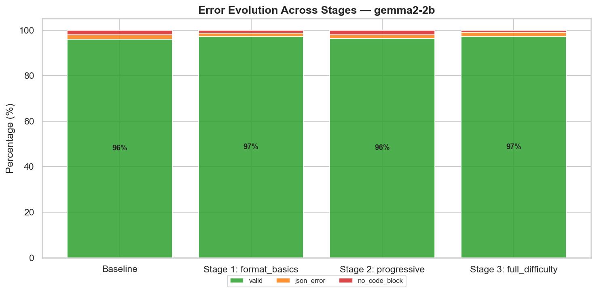

**Rescued vs Regressed**:

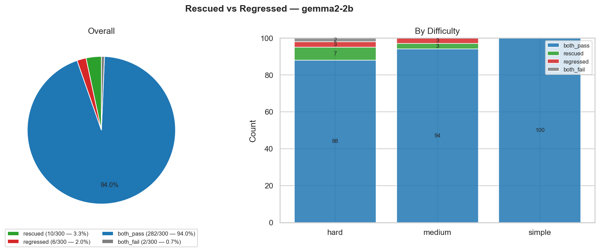

---

### Cross-model discussion

**Does model size correlate with improvement?** Not linearly. The relationship follows an **inverted-U pattern**: the smallest model (135M) and the 1.1B model benefit the most (+47 pp and +23 pp respectively), while the already-strong 0.5B and 2B models see marginal gains. This suggests GRPO is most effective in the regime where the model has sufficient capacity to learn new patterns but has not yet been adequately instruction-tuned for structured output.

**Which difficulty tier benefits most?** Hard prompts consistently show the largest absolute improvement across all models. SmolLM2-135M hard pass rate goes from 20% → 82% (+62 pp), TinyLlama from 55% → 96% (+41 pp), SmolLM2-360M from 58% → 95% (+37 pp). Simple prompts saturate early (Stage 1), confirming the curriculum design is effective.

**Is the curriculum necessary?** The stage-by-stage progression shows that Stage 1 alone accounts for 40–70% of the total improvement, but Stages 2–3 are critical for hard prompts. Without them, SmolLM2-135M would plateau at 59% instead of reaching 86%. The curriculum provides a clear return on training compute.

**Error type analysis.** Across all models, the dominant baseline error is `no_code_block` (the model generates raw JSON without the required ` ```json ``` ` fence). Stage 1 nearly eliminates this error type. Remaining failures after Stage 3 are predominantly `json_error` (invalid JSON syntax), suggesting the models have learned the format but occasionally produce malformed structures on complex schemas.

**Convergence.** Despite a 14× parameter gap (135M vs 2B), all models converge to a narrow 86–97% band after training. This demonstrates that GRPO with curriculum learning is an effective equaliser for structured-output tasks, substantially reducing the practical impact of model size.

## 6. Conclusion and Limitations

### Summary

We presented a reproducible pipeline for aligning small LLMs to strict JSON generation using GRPO with rule-based rewards and curriculum learning. The approach is lightweight (single GPU, LoRA, 4-bit quantisation) and does not require human annotations or a neural reward model.

Across five models spanning a 14× parameter range (135 M – 2 B), the GRPO curriculum consistently improved JSON compliance: the weakest model (SmolLM2-135M) improved from 38.67% to 86.00% (+47.33 pp), while even the strongest baseline (Gemma-2-2B at 96.00%) saw a small gain to 97.33%. All models converged to a narrow 86–97% band after 2 500 training steps, demonstrating that rule-based GRPO with curriculum learning is an effective method for teaching strict structured output to small models — substantially reducing the practical impact of model size for this task.

### Limitations

- **Synthetic prompts only.** The template-based dataset, while diverse (24 templates × random parametrisation), does not cover all real-world JSON use cases. Models may not generalise to free-form user requests outside the template distribution.
- **Single evaluation metric.** Pass@1 measures whether the output is valid JSON conforming to the schema, but does not assess semantic quality (e.g., whether generated values are plausible).
- **No comparison with DPO/PPO.** We only tested GRPO; comparing with other RLHF methods would contextualise the results.
- **Fixed hyperparameters.** The same LoRA rank, learning rate, and reward weights are used for all models. Per-model tuning could improve individual results.

### Future work

- **Real-world benchmark.** Evaluate on established structured-output benchmarks (e.g., tool-use datasets, function-calling benchmarks).
- **Reward ablation.** Systematically disable or reweight individual reward components to measure their marginal contribution.
- **Reasoning mode.** Enable `thinking: true` and investigate whether chain-of-thought improves hard-prompt schema compliance.
- **Scale up.** Apply the same pipeline to 7 B+ models to establish an upper bound on this approach.

## 7. Additional Information

### 7.1 Contribution Breakdown
- **Giuseppe Bellamacina**: Full project design and implementation — synthetic dataset generator, reward functions, curriculum training pipeline, evaluation framework, cluster infrastructure (SLURM scripts, Apptainer container, monitoring tools), documentation, and analysis.

### 7.2 Use of Artificial Intelligence
GitHub Copilot and Claude were used as coding assistants throughout the project for:
- **Boilerplate generation**: SLURM scripts, Docker/Apptainer configuration, YAML configs.
- **Debugging**: Diagnosing CUDA OOM errors, SLURM job failures, tokenizer compatibility issues.
- **Documentation**: Drafting and reviewing markdown documentation.
- **Code review**: Identifying edge cases in reward functions and evaluation logic.

All architectural decisions (reward component design, curriculum staging, model selection, quantisation strategy) were made by the author. The AI tools accelerated implementation but did not originate the methodology.

## References

[1] B. Agarwal, I. Joshi, V. Rojkova, "Think Inside the JSON: Reinforcement Strategy for Strict LLM Schema Adherence," *arXiv:2502.14905*, 2025. [Paper](https://arxiv.org/abs/2502.14905) · [PDF](papers/2502.14905v1.pdf)

[2] R. Hu, S. Wu, "RL-Struct: A Lightweight Reinforcement Learning Framework for Reliable Structured Output in LLMs," *arXiv:2512.00319*, 2025. [Paper](https://arxiv.org/abs/2512.00319) · [PDF](papers/2512.00319v2.pdf)

[3] F. Pennino, B. Raimondi, M. Rondelli, A. Gurioli, M. Gabbrielli, "From Reasoning to Code: GRPO Optimization for Underrepresented Languages," *arXiv:2506.11027*, 2025. [Paper](https://arxiv.org/abs/2506.11027) · [PDF](papers/2506.11027v2.pdf)

[4] C. Qian, E. C. Acikgoz, Q. He, H. Wang, X. Chen, D. Hakkani-Tür, G. Tur, H. Ji, "ToolRL: Reward is All Tool Learning Needs," *arXiv:2504.13958*, 2025. [Paper](https://arxiv.org/abs/2504.13958) · [PDF](papers/2504.13958v1.pdf)

[5] Unsloth Documentation. [https://unsloth.ai/docs](https://unsloth.ai/docs)

[6] Ando AI, "AI GRPO — A Deep Dive into Group Relative Policy Optimization." [https://blog.ando.ai/posts/ai-grpo/](https://blog.ando.ai/posts/ai-grpo/)

[7] L. Bometon, "Fine-Tuning GRPO with LLM Judge: From Zero to Production," Medium, 2025. [https://medium.com/@lbometon2/fine-tuning-grpo-with-llm-judge-from-zero-to-production-69a25a4ab3bd](https://medium.com/@lbometon2/fine-tuning-grpo-with-llm-judge-from-zero-to-production-69a25a4ab3bd)

[8] Patronus AI, "Guide to RL Environments for LLMs." [https://www.patronus.ai/guide-to-rl-environments](https://www.patronus.ai/guide-to-rl-environments)
